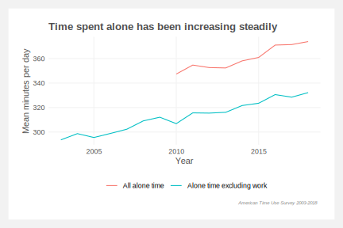

# Modeling loneliness on sub-populations of Americans using sequence techniques and multi-level models

Finding differences in time spent alone among subpopulations of Americans. First, by clustering respondents' activities by applying [sequence analysis techniques](https://en.wikipedia.org/wiki/Social_sequence_analysis) à la [Abbot](https://www.jstor.org/stable/2780695) — string-editing techniques, dissimilarity matrices, and hierarchical clustering. Then using cluster membership and year as nested variables in multi-level models to predict time spent alone.

See also: [ATUS repo](https://github.com/joemarlo/ATUS)

[Working doc](https://docs.google.com/document/d/16B8pjYeZv6RtWNh5Pqtz7to9whLEk2FyR-4FSyXgOe4/edit?usp=sharing)

 
 

