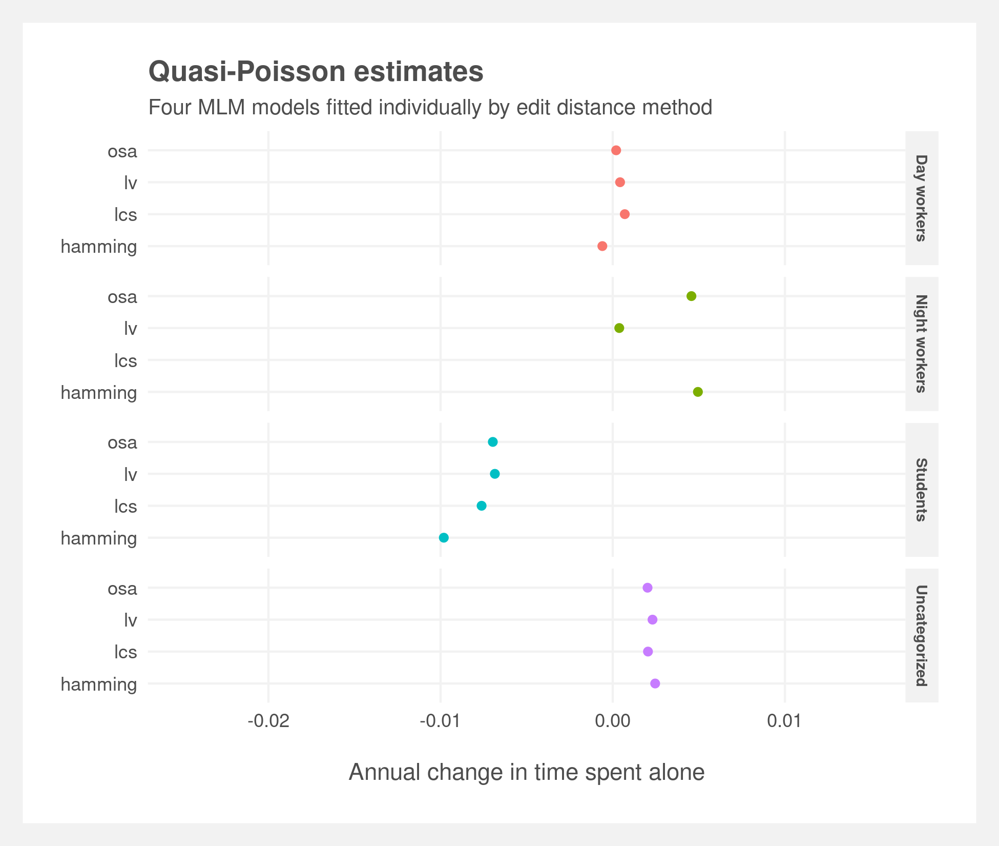
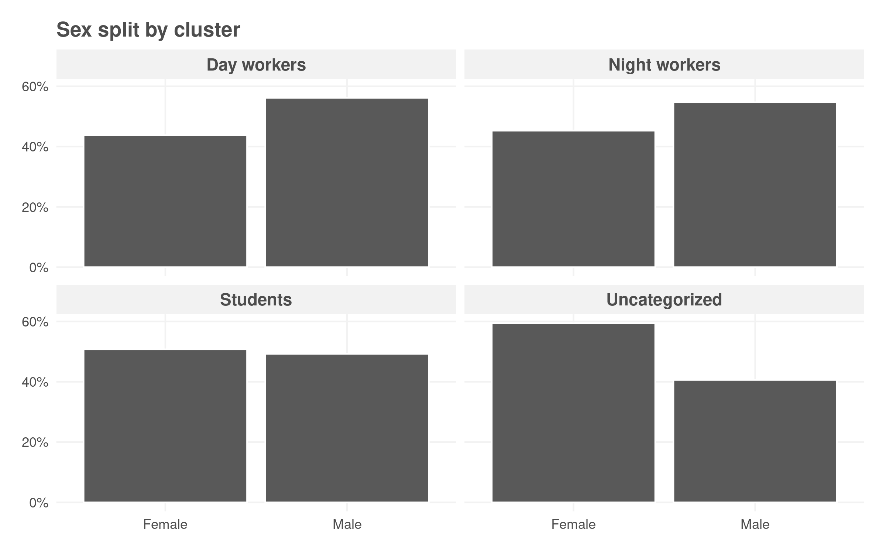
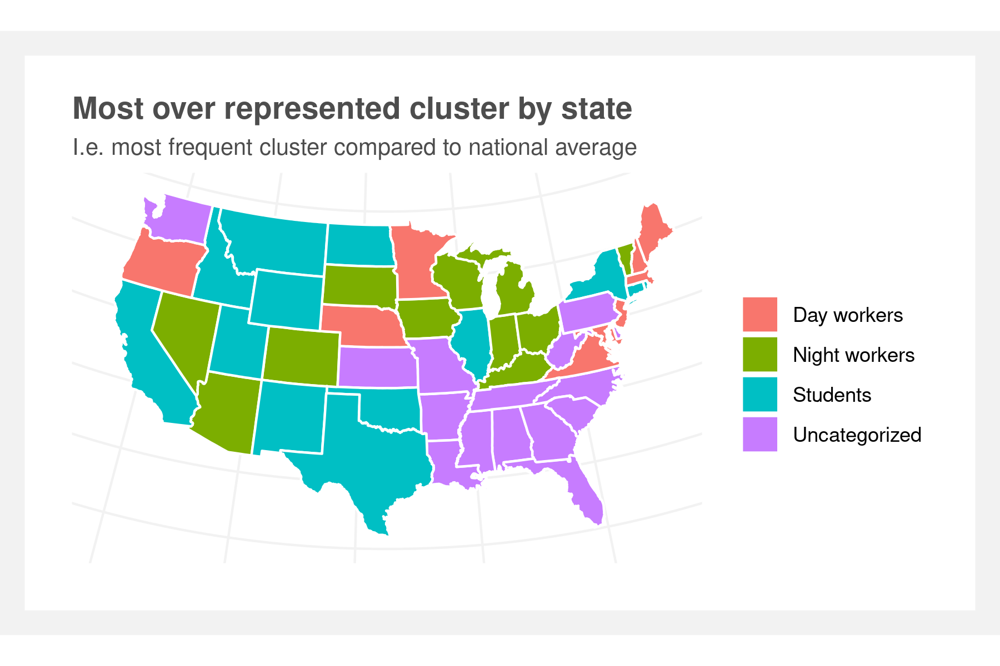

```{r setup, include=FALSE}
knitr::opts_chunk$set(message=FALSE, warning=FALSE, echo = FALSE, fig.pos = "H", out.extra = "", dev = "cairo_pdf")
```

```{r}
library(knitr)
library(pander)
library(tidyverse)
panderOptions('big.mark', ',')
```

```{r}
#rmarkdown::render("loneliest_american.Rmd")
```


\newpage

# Background

Time spent alone has been increasing among Americans. This can have numerous health effects and it may be impacting subpopulations differently. Data from the American Time Use Survey shows the mean amount of time spent on non-work activities with no other person present has steadily increased from ~295min per day to ~330min per day from 2003 to 2018/.


```{r out.width="60%", fig.align='center', fig.cap="Mean alone time 2003-2018",fig.show='hold'}

```


It’s intuitive that this increase may not be evenly distributed across the population. Rather than subdividing the population by demographics, the population can be divided using sequence analysis and unsupervised learning techniques to find clusters of similar time-use patterns. These in turn may represent distinct demographic groups (e.g. a cluster with large amounts of time spent on education consists mostly of sub 25 year olds) but are not direct measurements of demographics. This clustering methodology allows demarcation of groups based on their activity and may capture groups such as students, workers, and the elderly.


## Research question

>Are increases in time spent alone equally affecting different subpopulations of Americans?


## Loneliness

Traditional literature covering loneliness dates back to at least the 1960s where multiple researchers (Eddy (1961), Sisenwein (1964), Bradley  (1969)) applied Likert-like scales to measuring loneliness on unidimensinoal measures. Daniel Russell, et. al  (1978) introduced the UCLA Loneliness Scale^[Russell, D., Peplau, L.A A., & Ferguson, M. L. Developing a measure of loneliness. Journal of Personality Assessment, 1978, 42, 290-294] to formally measure loneliness using a multiple dimensional approach. And finally, a simple approach (Bradburn 1969) measured loneliness simply by asking participants if they feel lonely.

<!-- See https://www.researchgate.net/profile/Daniel_Russell4/publication/271766646_The_measurement_of_loneliness/links/56bbc30408ae7be8798be595.pdf   for citations -->

Popular articles in the NY Times (Fountain, 2006^[https://www.nytimes.com/2006/07/02/weekinreview/02fountain.html]), The Atlantic (Marche, 2012^[https://www.theatlantic.com/magazine/archive/2012/05/is-facebook-making-us-lonely/308930/]), and TIME (Durcharme, 2020^[https://time.com/5833681/loneliness-covid-19/]) tend to focus on an increase in loneliness among Americans and cite popular statistics such as "most adults only have two people they can talk to about the most important subjects in their lives." However, other researchers have found seemingly disparate results.  Clark, et. al (2014) performed a meta-analysis of American college students and American high school students using the UCLA Loneliness Scale and found that there have been declines in loneliness from 1978-2009 (Study 1) and 1991-2013 (Study 2).

The results may not be so disparate and could just be confounded by multiple attributes. Tijuis, et. al (1999)^[Tijhuis, M. A., et al. "Changes in and factors related to loneliness in older men. The Zutphen Elderly Study." Age and ageing 28.5 (1999): 491-495] sought to investigate if loneliness increases in old age or if it was due to cohort effects. They surveyed 939 men in 1985, 1990, and 1995 regarding a loneliness scale. They found that for their oldest cohort (born 1900-1920), the loneliness scores increased but the scores did not increase for the younger groups. They attributed their increase due to ageing and not due to cohort.

Perhaps most importantly, the risks associated with loneliness. Golden, et. al (2009)^[Golden, Jeannette, et al. "Loneliness, social support networks, mood and wellbeing in community‐dwelling elderly." International Journal of Geriatric Psychiatry: A journal of the psychiatry of late life and allied sciences 24.7 (2009): 694-700.] also found loneliness increased with age and that wellbeing, depressed mood, and hopelessness were all independently associated with loneliness. Tomaka, et. al (2006)^[Tomaka, Joe, Sharon Thompson, and Rebecca Palacios. "The relation of social isolation, loneliness, and social support to disease outcomes among the elderly." Journal of aging and health 18.3 (2006): 359-384.] found that "belongingness support related most consistently to health outcomes." Importantly they note that "isolation and loneliness may be related, there is no neccessary relationship between the two".

<!--
Defining loneliness:
- https://www.researchgate.net/profile/Daniel_Russell4/publication/271766646_The_measurement_of_loneliness/links/56bbc30408ae7be8798be595.pdf  
- "some suggest the evidence of social decline is based on flawed indicators " https://doi.apa.org/doiLanding?doi=10.1037%2F1040-3590.7.3.286  


Trends:
- loneliness over time meta-analysis https://journals.sagepub.com/doi/full/10.1177/0146167214557007?casa_token=qprWkQrW1p4AAAAA%3AtWSkTxcYjZJPx_4y5vtcKLKV6kJQQbOQ4lHz9T_7UKYya5_QN1cD12cxv6Z_JHL7fcf-sG1vrfor  
https://journals.sagepub.com/doi/pdf/10.1177/0146167214557007?casa_token=XBo4tQQKuVMAAAAA:5shRdNrXihow7T47O2S6Bc2yGbPoCVHOZeqoPMISXSMpKgz52DS-1IQ9SZtNMrMLEtv_jkvalAET

- "research that demonstrates declining social engagement; in comparison with decades past, people are less likely to join clubs, have fewer confidants, and are less likely to perceive others as trustworthy " 
https://journals.sagepub.com/doi/10.1177/000312240607100301  
- "Social engagement through the internet, however, could be replacing traditional forms of sociability" https://journals.sagepub.com/doi/10.1177/1948550612469233  
- https://books.google.com/books?hl=en&lr=&id=ySBrAAAAMAAJ&oi=fnd&pg=PA13&dq=loneliness+american&ots=dldWStCMS6&sig=NJGTmhoDtg7uXdLMX7pTA3oCgIc#v=onepage&q=loneliness%20american&f=false  

Elderly:
- "whether loneliness increases in old age, and if so, whether it relates to ageing itself, to time trends or to cohort effects and ... " https://academic.oup.com/ageing/article/28/5/491/36243  

- "loneliness explained the excess risk of depression in the widowed." https://onlinelibrary.wiley.com/doi/abs/10.1002/gps.2181?casa_token=0ym35WpAkZ0AAAAA%3ABdmKXAZTQ6C5xKe538Jvr9PPypZem0_zhZYvgOz7W6fKbK2Cklqw_Xslq8sQk5xF7sPCRAqyeVu35w  

- health outcomes https://journals.sagepub.com/doi/abs/10.1177/0898264305280993?casa_token=HF41nPUAZqUAAAAA:8zg6wBtozRz52BPPv6m-pkxQ1QlGCDJfxjmY_Uw63p9C7AsQDPT6C0MpFGcpasSnqqGgv4FRsBIo  
- https://journals.sagepub.com/doi/pdf/10.1177/0164027587094001  
- causal https://academic.oup.com/geronj/article-abstract/40/4/487/593670  

Pop:
- https://www.theatlantic.com/magazine/archive/2012/05/is-facebook-making-us-lonely/308930/  
- https://www.nytimes.com/2006/07/02/weekinreview/02fountain.html  
- A PLAGUE OF LONELINESS: Americans were already lonely. Then COVID-19 hit. By: DUCHARME, JAMIE, Time International (South Pacific Edition), 08180628, 6/22/2020, Vol. 195, Issue 23/24  
-->

<!--

## Sequences and time-use


Abbot (1990)^[Abbott, Andrew, and Alexandra Hrycak. “Measuring Resemblance in Sequence Data: An Optimal Matching Analysis of Musicians' Careers.” American Journal of Sociology, vol. 96, no. 1, 1990, pp. 144–185]

Methods related to time use
- Abbot: https://www.jstor.org/stable/2780695  
- https://www.sciencedirect.com/science/article/pii/S0965856416303470
- https://www.intechopen.com/online-first/clustering-of-time-series-data
- https://www.researchgate.net/publication/271759653_The_Social_Structure_of_Time_Optimal_Matching_for_Time-Use_Data

-->

<!-- 
"optimal matching on the continuous time-use data of the pooled Flemish time-use survey of 1999 and 2004"
- https://www.researchgate.net/profile/Joeri_Minnen/publication/225662853_In_Search_of_the_Harried_Leisure_Class_in_Contemporary_Society_Time-Use_Surveys_and_Patterns_of_Leisure_Time_Consumption/links/54c1115e0cf2dd3cb957f6a0/In-Search-of-the-Harried-Leisure-Class-in-Contemporary-Society-Time-Use-Surveys-and-Patterns-of-Leisure-Time-Consumption.pdf
-->


## Alone time definition

The American Time Use Survey tracks alone time via a computation of other collected variables. For each activity — except those noted below — the BLS tracks the number of participants present during the activity. Alone time is tallied only during activities for which only the primary respondent is physically present. Compared to many studies pertaining to loneliness, this approach is measuring the quantity of time spent alone and is not addressing the mental state of loneliness.

The benefit of this approach is detailed data on the length of time and description of the activity in which the person is alone. The shortcomings of this approach is that it only pertains to physicality. Therefore mental health is not directly addressed and activities such as phone or video calls will be labeled as 'alone' unless there is an additionally person physically present. Additionally, a few activities are specifically excluded from the tally including:

- Working  
- Sleeping  
- Washing, dressing, or grooming  
- Personal/private activities  
- Any time in which the respondent refused to provide activity detail

The question posed to respondents to define who was present:  

> "Who was in the room with you / Who accompanied you?"

The BLS also includes another variable, `TRTALONE_WK` which is similar to `TRTALONE` but includes alone time during work activities. This is excluded for the analysis as it is only available 2010-2018.

<!-- verified physicality by looking at phone calls. 70% of phone calls have no one else present -->


## American Time Use Survey

The American Time Use Survey data contains a nationally representative estimates of how, where, and with whom Americans spend their time. The sampling frame is the Census Current Population Survey (CPS) and covers over 200,000 interviews conducted from 2003 to 2018. The survey is phone-based, repeated cross-section, and randomized by day of the week. The data can be linked to the CPS for detailed household demographic information. 

# Methodology

The analysis consists of two major parts: 1. Calculate and cluster sequences of activities and 2. Model alone time as a function of year and cluster to understand if alone time is increasing or decreasing for a given cluster. 

Clustering methods will be used to determine similar sequences of how individuals spend their day irrespective of alone time. The primary techniques will be using optimal matching string editing techniques. This is non-parametric technique that determines distance between two sequences by the least number of operations that are required to convert one sequence into the other. The operations are insertion, deletions, and substitutions where insertion/deletion are typically referred to collectively as 'indel.'  <!--[Abbot](https://www.jstor.org/stable/2780695). -->

<!--
String editing techniques will start by aggregating the different types of activities from 465 specific activities into 15 activities based on their hierarchical definitions provided by the BLS. These 15 activities will then be recoded as single character strings representing how an individual spends each 30 minute period of their day. Their full day’s activity is represented by the resulting 48 character string.
-->

## Data detail

Data comes from The American Time Use which surveys how Americans spend their time. The diary (`atusact_0318` file) and CPS (`atuscps_0318` file) data are used from the 2003-2018 Multi-Year Interview dataset. The data details each minute of the respondent's day by mapping it to a list of 465 activities. The author then aggregated these 465 activities into 15 activities based on the Bureau of Labor Statistics' (BLS) hierarchical definitions and the author's judgment. See Appendix Table 3 for the aggregation mapping. Additionally, to reduce computation load, each respondents' day was summarized into 48 thirty-minute windows representing the modal activity during the window, and a weighted sample of 10,000 individuals was chosen.

Time use varies greatly between week and weekend days so only weekdays are included in the analysis. Similarly, holidays are excluded.

The activities of the sampled population are visualized below. Overall, the proportion of individuals participating in a given activity at a given time is mixed. Work (light pink) contains the plurality of individuals during midday, leisure (violet) in late afternoon, and sleep (blue) in the night.

```{r out.width="75%", fig.align='center', fig.cap="State distribution (p1 represents 4am and every period thereafter is 30 minutes)", fig.show='hold'}

```


# Distance measures

String editing techniques will start by aggregating the different types of activities from 465 specific activities into 15 activities based on their hierarchical definitions provided by the BLS. These 15 activities are then be recoded as single character strings representing how an individual spends each 30 minute period of their day. Their full day’s activity is represented by the resulting 48 character string.

The distance between the respondents string sequences can be calculated using a number of different string distance measures under the optimal matching framework. First, measures with constant insertion/deletion (indel) and substitution costs will be considered. Then the substitution costs will be calculated using the transition rate between states (TRATE).

Measures to be explored:  
- Hamming: only allows substitution  
- Longest common subsequence (LCS): only allows insertions and deletions  
- Dynamic Hamming: only allows substitutions but costs depend on position within the sequence  
- TRATE: costs derived from transition rates   

Each of these have advantages and disadvantages that will be explored along with their impact on the final clustering.

The Hamming distance, in this context, implies we are firmly interested in not just the sequence of the time-use activities but also when those activities occur with the day. This aligns with an intuitive understanding that one person waking up in the morning and having breakfast is not an identical activity to another person waking up in the evening from a nap and having dinner even though both are participating in the activity of "sleep" and then "eating."

LCS is the inverse of Hamming. Substitutions are not allowed, and the pattern of interest is sequence of the time-use activities agnostic of when they occur. Referencing on the previous example, the morning and evening persons' activities would be considered identical.

These both may be too stringent of a definition, though. Allowing indels by setting low costs for substitutions may offer a more flexible approach while still retaining the general structure of the day.

Dynamic Hamming is a modification of Hamming which still only allows substitutions but the costs depend on the position within the sequence. The result is slightly more flexibility but is still heavily sensitive to the timing of activities similar to Hamming. 

TRATE is fundamentally different. The costs are derived from the observed transition rates between activities. The substitution cost is then calculated via $cval - P(i|j) - P(j|i)$ where $cval$ is a constant and $P(i|j)$ is the probability of transition from state $j$ to $i$.

<!--
- Optimal matching: 
  - Various insertion/deletion costs
  - Various substitution costs
    - CONSTANT: same cost for all substitutions
      - when substitution cost = 2 and indel = 1 then OM  == LCS
      - when indel = 0 then OM == hamming
    - TRATE derived from observed transition rates .The transition probabilties between all pairs of states is first computed and then the substituion cost between states i and j is obtained via the probability of transition from 
    - FUTURE 

- Levenshtein distance: insertions, deletions or substitutions  
- Restricted Damerau-Levenshtein distance (OSA): insertions, deletions or substitutions of a single character, or transposition of two adjacent characters  
- Hamming distance: substitutions only. Between two strings of identical length - e.g. a given 24 hour day - it is the number of positions in which corresponding characters differ
- Longest common sub-sequence: insertions and deletions only  

<!-- https://rss.onlinelibrary.wiley.com/doi/pdf/10.1111/rssa.12125
Lesnard (2010) focused on OM without indels, such as the general-ized Hamming distance, and proposed that substitution costs should depend on the positiontin the sequence
-->


# Clustering

Once the string distance measures are applied, the resulting distance matrix is clustered using the Ward D2 hierarchical clustering algorithm. The number of clusters is determined using the Silhouette width method which is a measure of distance between clusters. The larger the Silhouette width, the more well separated the clusters.

## Efficacy of cross-sectional clustering

The data consists of cross-sectional observations of individuals' time use. The clusters are computed across years. Therefore, no single respondent represents more than one year but individual clusters span multiple years. This may present issues as the metric of interest is the change in time spent alone for a given cluster.

The respondents were split into two groups - one for years 2003-2010 and one for 2011-2018 - and then clustered separately. The resulting groups showed  similarity in clusters between these two groups and indicate there will be no discontinuity or heterogeneity issues when clustering across all years.

<!--
For convenience, Levenshtein distance (substitution cost = 1 and indel = 1) is used here, however similar results are expected for the other distance measures.

```{r out.width="45%", fig.align='center', fig.cap="Silhouette comparison",fig.show='hold'}
knitr::include_graphics(c("Analyses/Pre-post-comparison/Levenshtein 2003-2010_silhouette.png",
                          "Analyses/Pre-post-comparison/Levenshtein 2011-2018_silhouette.png"))
```
```{r out.width="45%", fig.align='center', fig.cap="Dendrogram comparison",fig.show='hold'}
knitr::include_graphics(c("Analyses/Pre-post-comparison/Levenshtein 2003-2010_dendrogram.png",
                          "Analyses/Pre-post-comparison/Levenshtein 2011-2018_dendrogram.png"))
```
```{r out.width="45%", fig.align='center', fig.cap="Sequence plots comparison",fig.show='hold'}
knitr::include_graphics(c("Analyses/Pre-post-comparison/Levenshtein 2003-2010_sequence_plots.png",
                          "Analyses/Pre-post-comparison/Levenshtein 2011-2018_sequence_plots.png"))
```
```{r out.width="45%", fig.align='center', fig.cap="Proportion plots comparison",fig.show='hold'}
knitr::include_graphics(c("Analyses/Pre-post-comparison/Levenshtein 2003-2010_proportion_plots.png",
                          "Analyses/Pre-post-comparison/Levenshtein 2011-2018_proportion_plots.png"))
```
-->

## Final clusters

The final clusters were created using a weighted sample of 10,000 respondents from the 2003-2018 surveys. The number of clusters is determined using the Silhouette method, and each edit distance method agrees that between three and six clusters are the ideal amount. 


```{r out.width="80%", fig.align='center', fig.cap="Silhouette comparison",fig.show='hold'}

```


The following dendrograms show the separation when k = 4. Interesting, the dendrograms are similar across the various edit distance methods. As expected, Hamming and Dynamic Hamming are the most similar. LCS and TRATE also appear similar. All four cut the four clusters at roughly the same points indicating there may be a resilient underlying structure to the time-use data.

```{r out.width="90%", fig.align='center', fig.cap="Dendrogram comparison",fig.show='hold'}

```


<!-- ```{r out.width="45%", fig.align='center', fig.cap="Silhouette distances",fig.show='hold'} -->
<!-- knitr::include_graphics(c("Analyses/Hamming/Plots/Hamming_silhouette.png", "Analyses/Levenshtein/Plots/Levenshtein_silhouette.png", -->
<!--                           "Analyses/OSA/Plots/OSA_silhouette.png", "Analyses/LCS/Plots/LCS_silhouette.png")) -->
<!-- ``` -->
<!-- ```{r out.width="45%", fig.align='center', fig.cap="Dendrograms",fig.show='hold'} -->
<!-- knitr::include_graphics(c("Analyses/Hamming/Plots/Hamming_dendrogram.png", "Analyses/Levenshtein/Plots/Levenshtein_dendrogram.png", -->
<!--                           "Analyses/OSA/Plots/OSA_dendrogram.png", "Analyses/LCS/Plots/LCS_dendrogram.png")) -->
<!-- ``` -->


The following state sequence, distribution, and modal activity plots tell the same story. Each edit distance methods finds a cluster most defined by work (pink), by education (light green), and leisure (violet). Both Hamming variants further find a cluster defined by evening work. Whereas the LCS and TRATE methods appears to split the leisure cluster into housework. 

```{r out.width="45%", fig.align='center', fig.cap="Sequence plots",fig.show='hold'}
knitr::include_graphics(c("Plots/TraMineR/Hamming_state_sequence.png", "Plots/TraMineR/LCS_state_sequence.png",
                          "Plots/TraMineR/Dynamic Hamming_state_sequence.png", "Plots/TraMineR/TRATE_state_sequence.png"))
```

```{r out.width="45%", fig.align='center', fig.cap="Distribution plots",fig.show='hold'}
knitr::include_graphics(c("Plots/TraMineR/Hamming_state_distribution.png", "Plots/TraMineR/LCS_state_distribution.png",
                          "Plots/TraMineR/Dynamic Hamming_state_distribution.png", "Plots/TraMineR/TRATE_state_distribution.png"))
```

```{r out.width="45%", fig.align='center', fig.cap="Modal activity plots",fig.show='hold'}
knitr::include_graphics(c("Plots/TraMineR/Hamming_state_modal.png", "Plots/TraMineR/LCS_state_modal.png",
                          "Plots/TraMineR/Dynamic Hamming_state_modal.png", "Plots/TraMineR/TRATE_state_modal.png"))
```

```{r out.width="45%", fig.align='center', fig.cap="Entropy plots",fig.show='hold'}
knitr::include_graphics(c("Plots/TraMineR/Hamming_state_entropy.png", "Plots/TraMineR/LCS_state_entropy.png",
                          "Plots/TraMineR/Dynamic Hamming_state_entropy.png", "Plots/TraMineR/TRATE_state_entropy.png"))
```


<!-- # ```{r out.width="45%", fig.align='center', fig.cap="Sequence plots",fig.show='hold'} -->
<!-- # knitr::include_graphics(c("Analyses/Hamming/Plots/Hamming_sequence_plots.png", "Analyses/Levenshtein/Plots/Levenshtein_sequence_plots.png", -->
<!-- #                           "Analyses/OSA/Plots/OSA_sequence_plots.png", "Analyses/LCS/Plots/LCS_sequence_plots.png")) -->
<!-- # ``` -->


<!-- ```{r out.width="45%", fig.align='center', fig.cap="Proportion plots",fig.show='hold'} -->
<!-- knitr::include_graphics(c("Analyses/Hamming/Plots/Hamming_proportion_plots.png", "Analyses/Levenshtein/Plots/Levenshtein_proportion_plots.png", -->
<!--                           "Analyses/OSA/Plots/OSA_proportion_plots.png", "Analyses/LCS/Plots/LCS_proportion_plots.png")) -->
<!-- ``` -->


## Categorization of clusters

The sequence and proportion plots illustrate the contents of each cluster are mostly consistent across the pairs of edit distance methods. For brevity, only the Dynamic Hamming clusters will be used in the modeling portion of the analysis. Each cluster can therefore be identified by their common characteristics: one cluster consisting of mostly daytime work will now be labeled as "Day workers", a second cluster of mostly evening and night work "Night workers", a third dominated by education "Students", and then the fourth contains a mixture of activities with no dominate characteristics so this will be referred to as "Uncategorized."

<!--
## Distance measure comparison

Visual inspections of the sequence and proportion plots appear to show consistency across the various edit distance measures. This is verified by examining the agreement in cluster membership. First, 90% of the respondents are clustered into the "same" cluster across methods. The remaining ~10% match to two separate clusters, and a small amount match to three. This is most likely due to the LCS method optimizing for a three cluster solution.

The pattern is clearer examined on a respondent-level basis. The right plot in Figure # shows the cluster assignment per respondent per method. Homogenous colors horizontally indicate full agreement across the edit distance measures.

```{r out.width="45%", fig.align='center', fig.cap="Cluster agreement across methods",fig.show='hold'}
knitr::include_graphics(c("Plots/cluster_agreement.png", "Plots/cluster_overlap.png"))
```
-->


# Modeling

<!-- mlm paper gallery https://www.cmm.bris.ac.uk/gallery/ -->

The goal is to understand how alone time has varied across different groups (i.e. clusters). Therefore, the unit of interest is the slope of alone time.

Single-level and multilevel models are both appropriate. Multilevel models "account for individual- and group-level variation in estimating group-level regression coefficients" and "estimate regression coefficients for particular groups" (Gelman Hill 2006). However, the clustering methods are signaling only four clusters are optimal. Gelman and Hill also note that "when the number of groups is small (less than five, say), there is typically not enough information to accurately estimate group-level variation. As a result, multilevel models in this setting typically gain little beyond classical varying-coefficient models."

As such, the approach is to fit both single- and multilevel models and draw comparisons.

<!-- what is a varying-coefficient model? -->

<!--
Benefit of multilevel

From Gelman Hill 2006:

"
There are various reasons why it might be worth moving to a multilevel model, whether for purposes of causal inference, the study of variation, or prediction of future outcomes:  

- Accounting for individual- and group-level variation in estimating group-level regression coefficients. For example, in the child support study in Section 11.2, interest lies in a city-level predictor (child support enforcement), and in classical regression it is not possible to include city indicators along with city-level predictors.
- Modeling variation among individual-level regression coefficients. In classical re- gression, one can do this using indicator variables, but multilevel modeling is convenient when we want to model the variation of these coefficients across groups, make predictions for new groups, or account for group-level variation in the uncertainty for individual-level coefficients.
- Estimating regression coefficients for particular groups. For example, in the next chapter, we discuss the problem of estimating radon levels from measurements in several counties in Minnesota. With a multilevel model, we can get reasonable estimates even for counties with small sample sizes, which would be difficult using classical regression.
"

"
When there is very little group-level variation, the multilevel model reduces to classical regression with no group indicators; conversely, when group-level coefficients vary greatly (compared to their standard errors of estimation), multilevel modeling reduces to classical regression with group indicators.
When the number of groups is small (less than five, say), there is typically not enough information to accurately estimate group-level variation. As a result, multi- level models in this setting typically gain little beyond classical varying-coefficient models.
"
-->


## Data generating process 

The time-use data is inherently count data. Uni-variate densities (below) show that the data is not distinctly Poisson, not zero-inflated, and overdispersion is an issue. 

```{r out.width="80%", fig.align='center', fig.cap="Densities of alone time by cluster",fig.show='hold'}

```

The mean daily alone minutes range from 202 to 400 per each cluster and the variances range from 19,724 to 81,265. This violates an assumption of Poisson models: mean equals variance. It suggests that the standard errors in the Poisson model will be severely underestimated.

Dispersion can also be defined as estimated dispersion via Gelman and Hill (2006, pg 114):

\begin{align*}
dispersion\: ratio &= \frac{1}{n - k}\sum_{i = 1}^{n}z_i^2 \\
n &= \#\: of\: data\: points  \\
k &= \#\: of\: predictors  \\
z &= standardized\: residuals = \frac{y_i - y^i}{sd(y^i)}
\end{align*}

Fitting a Poisson multilevel model to this data results in a dispersion ratio of 151.2 — far larger than 1 — indicating a quasi-Poisson or negative binomial model is necessary. Otherwise, the standard errors will need to be corrected by multiplying by a factor of $\sqrt{151} = 12.3$.

Ultimately, the data was transformed using square-root, and the resulting uni-variate densities are "normal enough" that a standard MLM can be fitted.

```{r out.width="80%", fig.align='center', fig.cap="Transformed densities of alone time by cluster",fig.show='hold'}

```


<!-- https://easystats.github.io/performance/reference/check_overdispersion.html -->

## Multiple single-level linear models

Four single-level linear models are fit to the data individually to estimate the effect of `Year` on per cluster per distance method. The only cluster to significantly differ from zero is the "Students" cluster. These point estimates range from -0.25 to -0.01, meaning the mean amount of alone time for students, on average, decreased approximately 0.12 minutes per year from 2003 to 2018.  

```{r out.width="75%", fig.align='center', fig.cap="Linear regression estimates",fig.show='hold'}

```

<!--

Model equation:
\noindent\begin{minipage}[t]{.45\linewidth}
\begin{align*}
log(\lambda) &= \alpha + \beta_1X_1 \\
\\
&and \\
\\
\sigma^2 &= \delta\mu \\ \\
\end{align*}
\end{minipage}
\begin{minipage}[t]{.45\linewidth}
\begin{align*}
\lambda &= mean\: count \\
X_1 &= alone\: time \\
\sigma^2 &= variance \\
\delta &= dispersion\: parameter \\
\mu &= mean \\
\end{align*}
\end{minipage}

-->

<!-- https://stats.stackexchange.com/questions/166506/how-to-express-a-poisson-regression-equation-as-a-quasi-poisson -->
<!-- https://www.radstats.org.uk/no104/Marchant2_104.pdf -->

<!--

The model form in R syntax is simply:  
\begin{center}
\texttt{Alone time $\sim$ year}
\end{center}


Briefly discuss model fit. Aliquet bibendum enim facilisis gravida neque. Sagittis eu volutpat odio facilisis mauris sit amet massa. Aliquet lectus proin nibh nisl condimentum. A cras semper auctor neque vitae. Lobortis scelerisque fermentum dui faucibus in ornare quam viverra orci. Est lorem ipsum dolor sit amet consectetur adipiscing elit. The standard errors on thee coefficient are as large as the estimates themselves, indicating there is far too much noise in this signal to be certain of the pattern.  

The coefficient for year is the difference in log counts. This can be also interpreted as the percentage increase in alone minutes per year. The only cluster to consistently and significantly differ from zero is the "Students" cluster. These point estimates range from -0.010 to -0.015, meaning the mean amount of alone time for students decreased at a rate of 1.0 to 1.5% per year from 2003 to 2018.  

-->

```{r out.width="75%", fig.align='center', fig.cap="Negative binomial estimates",fig.show='hold'}
# 
```

```{r out.width="75%", fig.align='center', fig.cap="Quasi-Poisson estimates",fig.show='hold'}
#
```

## Multilevel models

A multi-level model with cluster as varying intercept and year as fixed and random slope is proposed. However, the model fails to converge because !!!!!

The model form in R syntax:  
\begin{center}
\texttt{Alone time $\sim$ year + (year | cluster)}
\end{center}


<!--
$$
\begin{align*}
Level\: 1: \:\: & log(\lambda_{ij}) = \beta_0 + u_{0j} + e_{ij} \\
\\
Level\: 2: \:\: & \beta_0 &= grand\: mean \\
level\: 2\: residual\: u_{0j} & \sim N(0, \sigma_{u0}^2) \\
level\: 1\: residual\: e_{0j} & \sim N(0, \sigma_{e0}^2) \\
\lambda &= minutes\: alone
\end{align*}
$$
-->
<!--
$$
\begin{align*}
Level\: 1: \:\: & log(\lambda_{ij}) = \beta_{0j} + \beta_{1j} X_{ij} \\
\\
Level\: 2: \:\: & \beta_{0j} = \gamma_{00} + \gamma_{01}Z_{j} + u_{0j} \\
& \beta_{0j} = \gamma_{10} + \gamma_{11}Z_{j} + u_{1j} \\
u_{0j} & \sim N(0, \sigma_{u0}^2) \\
u_{0j} & \sim N(0, \sigma_{e0}^2) \\

Where:\: & \lambda_{ij} = minutes\: alone
\end{align*}
$$
-->


<!--

## Model fit

Describe diagnostics, residuals, etc. Facilisi cras fermentum odio eu. Quis enim lobortis scelerisque fermentum dui faucibus in. Commodo elit at imperdiet dui. Mi quis hendrerit dolor magna eget. Scelerisque purus semper eget duis at tellus at. Aliquet bibendum enim facilisis gravida neque. Sagittis eu volutpat odio facilisis mauris sit amet massa. Aliquet lectus proin nibh nisl condimentum. A cras semper auctor neque vitae. Lobortis scelerisque fermentum dui faucibus in ornare quam viverra orci. Est lorem ipsum dolor sit amet consectetur adipiscing elit.

-->
<!-- ```{r} -->
<!-- broom.mixed::tidy(mlm_qp) %>% -->
<!--   .[, 1:6] %>% -->
<!--   pander::pander(justify = 'lllrrr', -->
<!--                  digits = 4, -->
<!--                  round = 4, -->
<!--                  caption = 'Multilevel quasi-Poisson model diagnostics') -->
<!-- # broom.mixed::glance(mlm_qp) %>% -->
<!-- #   pander::pander(justify = 'rrrrrr', -->
<!-- #                  caption = 'Multilevel quasi-poisson model diagnostics') -->
<!-- ``` -->

<!--
## Model discussion

BLUPs are similar to the single-level models, however with some shrinkage towards zero. Discuss issues. Duis aute irure dolor in reprehenderit in voluptate velit esse cillum dolore eu fugiat nulla pariatur. Excepteur sint occaecat cupidatat non proident, sunt in culpa qui officia deserunt mollit anim id est laborum.

Discuss interpretation of effects. dio pellentesque diam volutpat commodo sed egestas egestas fringilla. Consectetur lorem donec massa sapien faucibus. Euismod nisi porta lorem mollis aliquam ut porttitor leo a. Metus dictum at tempor commodo. Aliquam etiam erat velit scelerisque in dictum non consectetur.

Discuss residuals

-->

<!-- There's an issue here with singularities -->

<!--

```{r out.width="80%", fig.align='center', fig.cap="All edit distance measures: Multilevel negative binomial effects",fig.show='hold'}
# knitr::include_graphics("Plots/negbin_mlm_effects_all_methods.png")
```

```{r out.width="80%", fig.align='center', fig.cap="All edit distance measures: Multilevel quasi-Poisson estimates",fig.show='hold'}

```


```{r out.width="80%", fig.align='center', fig.cap="Hamming edit distance: Multilevel negative binomial effects",fig.show='hold'}
knitr::include_graphics("Plots/hamming_negbin_mlm_effects.png")
```

-->

# Associated demographics

The associated demographics of the clusters skew towards expected values. The day workers consist mostly of mid-20 year-olds to 60 year-olds. The night workers skew much younger. And students consists almost entirely of sub 20 year-olds while the Uncategorized cluster is a mixed bag.


```{r out.width="80%", fig.align='center', fig.cap="Densities of age by cluster",fig.show='hold'}

```

```{r out.width="80%", fig.align='center', fig.cap="Sex split by cluster",fig.show='hold'}

```


# Conclusion

The optimal matching sequence techniques were able to find distinct clusters among the respondents' time-use activities. The four edit-distance methods found similar clusters which may signal a strong underlying structure to American's time-use. Using these resulting clusters as input into modeling proved less than fruitful. Simple OLS linear regression found that the cluster representing students is associated with a statistically significant decline in alone time between 2003 and 2018. However, the effect is minimal at approximately seven seconds per year. Attempts to apply multi-level models was difficult due to convergence issues.

\  


# Software

R Core Team (2020). R: A language and environment for statistical computing. R Foundation for Statistical Computing, Vienna, Austria. URL https://www.R-project.org/.

Gabadinho, A., Ritschard, G., Müller, N. S., & Studer, M. (2011). Analyzing and Visualizing State Sequences in R with TraMineR. Journal of Statistical Software, 40(4), 1-37. DOI http://dx.doi.org/10.18637/jss.v040.i04.
  
Studer, M. & Ritschard, G. (2016). What matters in differences between life trajectories: A comparative review of sequence dissimilarity measures, Journal of the Royal Statistical Society, Series A, 179(2), 481-511. DOI http://dx.doi.org/10.1111/rssa.12125

Daniel Müllner (2013). fastcluster: Fast Hierarchical, Agglomerative Clustering Routines for R and Python. Journal of Statistical Software, 53(9), 1-18. URL http://www.jstatsoft.org/v53/i09/.

Wickham et al., (2019). Welcome to the tidyverse. Journal of Open Source Software, 4(43), 1686, https://doi.org/10.21105/joss.01686

Malika Charrad, Nadia Ghazzali, Veronique Boiteau, Azam Niknafs (2014). NbClust: An R Package for Determining the Relevant Number of Clusters in a Data Set. Journal of Statistical Software, 61(6), 1-36. URL http://www.jstatsoft.org/v61/i06/.

van der Loo M (2014). “The stringdist package for approximate string matching.” _The R Journal_, *6*, 111-122. URL https://CRAN.R-project.org/package=stringdist.

# Appendix

## Other

```{r}
tribble(
  ~`Activity code`, ~`Description`,
  't0101.*',  'Sleep',
  't010[2-9].*','Personal Care',
  't019.*',   'Personal Care',
  't1801.*',  'Personal Care',
  't02.*',    'Household Activities',
  't1802.*',  'Household Activities',
  't03.*',    'Caring For Household Member',
  't1803.*',  'Caring For Household Member',
  't04.*',    'Caring For Nonhousehold Members',
  't1804.*',  'Caring For Nonhousehold Members',
  't05.*',    'Work',
  't1805.*',  'Work',
  't06.*',    'Education',
  't1806.*',  'Education',
  't07.*',    'Consumer Purchases',
  't1807.*',  'Consumer Purchases',
  't08.*',    'Professional & Personal Care Services',
  't1808.*',  'Professional & Personal Care Services',
  't09.*',    'Other',
  't1809.*',  'Other',
  't10.*',    'Other',
  't1810.*',  'Other',
  't11.*',    'Eating and Drinking',
  't1811.*',  'Eating and Drinking',
  't12.*',    'Socializing, Relaxing, and Leisure',
  't1812.*',  'Socializing, Relaxing, and Leisure',
  't13.*',    'Sports, Exercise, and Recreation',
  't1813.*',  'Sports, Exercise, and Recreation',
  't14.*',    'Religious and Spiritual',
  't1814.*',  'Religious and Spiritual',
  't15.*',    'Volunteer',
  't1815.*',  'Volunteer',
  't16.*',    'Other',
  't1816.*',  'Other',
  't1818.*',  'Other',
  't1819.*',  'Other',
  't189.*',  'Other',
  't50.*',    'Other'
) %>%
  pander::pander(justify = 'left',
                 caption = 'Activity aggregation mapping')
```

```{r out.width="80%", fig.align='center', fig.cap="Most over represented cluster by state",fig.show='hold'}

```


## Results from previous models

```{r out.width="83%", fig.align='center', fig.cap="Poisson single-level effects",fig.show='hold'}

```

```{r out.width="83%", fig.align='center', fig.cap="Poisson MLM effects",fig.show='hold'}

```

```{r out.width="75%", fig.align='center', fig.cap="Quasi-Poisson estimates",fig.show='hold'}

```

```{r out.width="80%", fig.align='center', fig.cap="All edit distance measures: Multilevel quasi-Poisson estimates",fig.show='hold'}

```

```{r out.width="75%", fig.align='center', fig.cap="Negative binomial estimates",fig.show='hold'}

```

```{r out.width="80%", fig.align='center', fig.cap="All edit distance measures: Multilevel negative binomial effects",fig.show='hold'}
knitr::include_graphics("Plots/negbin_mlm_effects_all_methods.png")
```

```{r out.width="80%", fig.align='center', fig.cap="Hamming edit distance: Multilevel negative binomial effects",fig.show='hold'}
knitr::include_graphics("Plots/hamming_negbin_mlm_effects.png")
```

```{r out.width="83%", fig.align='center', fig.cap="Bayesian negative binomial MLM effects",fig.show='hold'}

```


