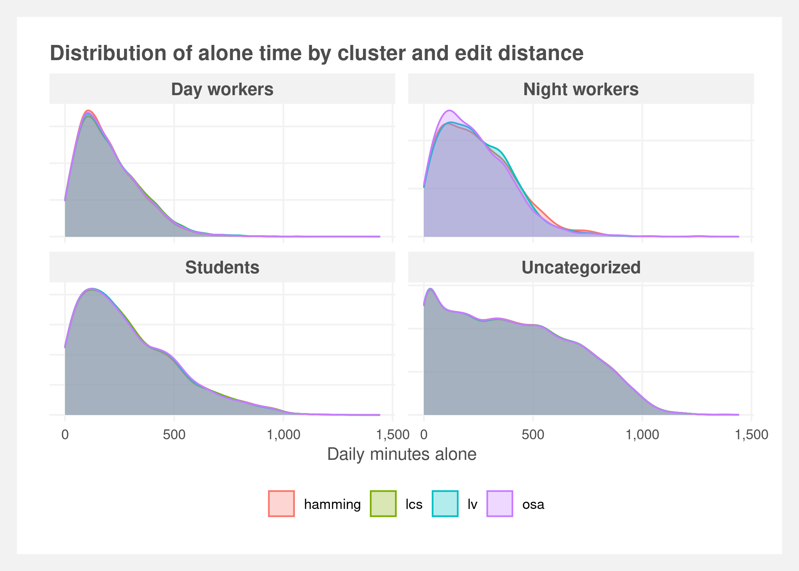

```{r setup, include=FALSE}
knitr::opts_chunk$set(message=FALSE, warning=FALSE, echo = FALSE, fig.pos = "H", out.extra = "", dev = "cairo_pdf")
```

```{r}
library(knitr)
library(pander)
library(tidyverse)
panderOptions('big.mark', ',')
```

```{r}
#rmarkdown::render("loneliest_american.Rmd")
```


\newpage

# Background

Time spent alone has been increasing among Americans. This can have numerous health effects (x,y,z) and it may be impacting subpopulations differently. Data from the American Time Use Survey shows the mean amount of time spent on non-work activities with no other person present has steadily increased from ~295min per day to ~330min per day.


```{r out.width="60%", fig.align='center', fig.cap="Mean alone time 2003-2018",fig.show='hold'}
knitr::include_graphics("Plots/mean_alone_time.png")
```


It’s intuitive that this increase may not be evenly distributed across the population. Rather than subdividing the population by demographics, the population can be divided using sequence analysis and unsupervised learning techniques to find clusters of similar time-use patterns. These in turn may represent distinct demographic groups (e.g. a cluster with large amounts of time spent on education consists mostly of sub 25 year olds) but are not direct measurements of demographics. The clustering methodology allows demarcation of groups based on their activity and may capture groups such as students, workers, and the elderly.


## Research question

>Are increases in time spent alone equally affecting different subpopulations of Americans?


## Alone time definition

The American Time Use Survey tracks alone time via a computation of other collected variables. For each activity — except those noted below — the BLS tracks the number of participants present during the activity. Alone time is tallied only during activities for which only the primary respondent is present.

Activities that are excluded from the tally include: 

- Working  
- Sleeping  
- Washing, dressing, or grooming  
- Personal/private activities  
- Any time in which the respondent refused to provide activity detail

The BLS also includes another variable, `TRTALONE_WK` which is similar to `TRTALONE` but includes alone time during work activities. This is excluded for the analysis as it is only available 2010-2018.


# Literature review

Lorem ipsum dolor sit amet, consectetur adipiscing elit, sed do eiusmod tempor incididunt ut labore et dolore magna aliqua. Ut enim ad minim veniam, quis nostrud exercitation ullamco laboris nisi ut aliquip ex ea commodo consequat. Duis aute irure dolor in reprehenderit in voluptate velit esse cillum dolore eu fugiat nulla pariatur. Excepteur sint occaecat cupidatat non proident, sunt in culpa qui officia deserunt mollit anim id est laborum.

Mattis enim ut tellus elementum sagittis vitae et. Odio pellentesque diam volutpat commodo sed egestas egestas fringilla. Consectetur lorem donec massa sapien faucibus. Euismod nisi porta lorem mollis aliquam ut porttitor leo a. Metus dictum at tempor commodo. Aliquam etiam erat velit scelerisque in dictum non consectetur. Volutpat odio facilisis mauris sit amet massa vitae tortor condimentum. Nibh venenatis cras sed felis eget velit. 

Facilisi cras fermentum odio eu. Quis enim lobortis scelerisque fermentum dui faucibus in. Commodo elit at imperdiet dui. Mi quis hendrerit dolor magna eget. Scelerisque purus semper eget duis at tellus at. Aliquet bibendum enim facilisis gravida neque. Sagittis eu volutpat odio facilisis mauris sit amet massa. Aliquet lectus proin nibh nisl condimentum. A cras semper auctor neque vitae. Lobortis scelerisque fermentum dui faucibus in ornare quam viverra orci. Est lorem ipsum dolor sit amet consectetur adipiscing elit. 

Arcu dictum varius duis at consectetur lorem donec massa. Vestibulum lectus mauris ultrices eros in cursus turpis massa tincidunt. Dui accumsan sit amet nulla. At tellus at urna condimentum mattis pellentesque id nibh tortor. Interdum velit euismod in pellentesque massa placerat. Massa sed elementum tempus egestas. Turpis egestas integer eget aliquet nibh. Cursus eget nunc scelerisque viverra mauris in aliquam sem.


# Methodology

Clustering methods will be used to determine similar sequences of how individuals spend their day. Primary techniques will be using string editing techniques ([Abbot](https://www.jstor.org/stable/2780695)) and secondary techniques include model based clustering…

String editing techniques will start by aggregating the different types of activities from 465 specific activities into 15 activities based on their hierarchical definitions provided by the BLS. These 15 activities will then be recoded as single character strings representing how an individual spends each 30 minute period of their day. Their full day’s activity is represented by the resulting 48 character string.

## Data detail

Data comes from The American Time Use which surveys how Americans spend their time. The diary (`atusact` file) and CPS (`atuscps_0318` file) data will be used from the 2003-2018 Multi-Year Interview dataset.

2003-2018 data
TULINENO == 1
weekdays only
The ATUS Activity file was used `atusact_0318`
data is collected at the minute level started at 4am-4am
To reduce computation load, each respondents' day was summarized into 48 thirty-minute windows representing the model activity during the window.

Activities are 


# Distance measures

String editing techniques will start by aggregating the different types of activities from 465 specific activities into 15 activities based on their hierarchical definitions provided by the BLS. These 15 activities will then be recoded as single character strings representing how an individual spends each 30 minute period of their day. Their full day’s activity is represented by the resulting 48 character string.

The distance between the respondents string sequences can be calculated using a number of different string distance measures:

- Levenshtein distance: insertions, deletions or substitutions  
- Restricted Damerau-Levenshtein distance (OSA): insertions, deletions or substitutions of a single character, or transposition of two adjacent characters  
- Hamming distanc: substitutions only  
- Longest common subsequence: insertions and deletions only  

Each of these have advantages and disadvantages that will be explored along with their impact on the final clustering.


# Clustering

Facilisi cras fermentum odio eu. Quis enim lobortis scelerisque fermentum dui faucibus in. Commodo elit at imperdiet dui. Mi quis hendrerit dolor magna eget. Scelerisque purus semper eget duis at tellus at. Aliquet bibendum enim facilisis gravida neque. Sagittis eu volutpat odio facilisis mauris sit amet massa. Aliquet lectus proin nibh nisl condimentum. A cras semper auctor neque vitae. Lobortis scelerisque fermentum dui faucibus in ornare quam viverra orci. Est lorem ipsum dolor sit amet consectetur adipiscing elit. 

## Efficacy of cross-sectional clustering

The data consists of cross-sectional observations of individual's time use. The clusters are computed across years. Therefore, no single respondent represents more than one year but individual clusters consists of multiple years.

```{r out.width="45%", fig.align='center', fig.cap="Silhouette comparison",fig.show='hold'}
knitr::include_graphics(c("Analyses/Pre-post-comparison/Levenshtein 2003-2010_silhouette.png",
                          "Analyses/Pre-post-comparison/Levenshtein 2011-2018_silhouette.png"))
```
```{r out.width="45%", fig.align='center', fig.cap="Dendrogram comparison",fig.show='hold'}
knitr::include_graphics(c("Analyses/Pre-post-comparison/Levenshtein 2003-2010_dendrogram.png",
                          "Analyses/Pre-post-comparison/Levenshtein 2011-2018_dendrogram.png"))
```
```{r out.width="45%", fig.align='center', fig.cap="Sequence plots comparison",fig.show='hold'}
knitr::include_graphics(c("Analyses/Pre-post-comparison/Levenshtein 2003-2010_sequence_plots.png",
                          "Analyses/Pre-post-comparison/Levenshtein 2011-2018_sequence_plots.png"))
```
```{r out.width="45%", fig.align='center', fig.cap="Proportion plots comparison",fig.show='hold'}
knitr::include_graphics(c("Analyses/Pre-post-comparison/Levenshtein 2003-2010_proportion_plots.png",
                          "Analyses/Pre-post-comparison/Levenshtein 2011-2018_proportion_plots.png"))
```

## Final clusters

The final clusters were created using a weighted sample of 25,000 respondents from the 2003-2018 surveys. 

Discuss silhouettes and dendrogram

```{r out.width="45%", fig.align='center', fig.cap="Silhouette distances",fig.show='hold'}
# knitr::include_graphics(c("Analyses/Hamming/Plots/Hamming_silhouette.png", "Analyses/Levenshtein/Plots/Levenshtein_silhouette.png",
#                           "Analyses/OSA/Plots/OSA_silhouette.png", "Analyses/LCS/Plots/LCS_silhouette.png"))
```
```{r out.width="45%", fig.align='center', fig.cap="Dendrograms",fig.show='hold'}
# knitr::include_graphics(c("Analyses/Hamming/Plots/Hamming_dendrogram.png", "Analyses/Levenshtein/Plots/Levenshtein_dendrogram.png",
#                           "Analyses/OSA/Plots/OSA_dendrogram.png", "Analyses/LCS/Plots/LCS_dendrogram.png"))
```


Discuss sequence plots and patterns

```{r out.width="45%", fig.align='center', fig.cap="Sequence plots",fig.show='hold'}
knitr::include_graphics(c("Analyses/Hamming/Plots/Hamming_sequence_plots.png", "Analyses/Levenshtein/Plots/Levenshtein_sequence_plots.png",
                          "Analyses/OSA/Plots/OSA_sequence_plots.png", "Analyses/LCS/Plots/LCS_sequence_plots.png"))
```
```{r out.width="45%", fig.align='center', fig.cap="Proportion plots",fig.show='hold'}
knitr::include_graphics(c("Analyses/Hamming/Plots/Hamming_proportion_plots.png", "Analyses/Levenshtein/Plots/Levenshtein_proportion_plots.png",
                          "Analyses/OSA/Plots/OSA_proportion_plots.png", "Analyses/LCS/Plots/LCS_proportion_plots.png"))
```


## Categorization of clusters

Eleifend mi in nulla posuere sollicitudin aliquam ultrices sagittis. Ultricies mi quis hendrerit dolor magna eget est. Pharetra diam sit amet nisl suscipit adipiscing. Donec pretium vulputate sapien nec. Arcu odio ut sem nulla pharetra. Dolor sit amet consectetur adipiscing elit pellentesque habitant morbi.

## Distance measure comparison

Visual inspections of the sequence and proportion plots appear to show consistency across the various edit distance measures. This is verified by examining the agreement in cluster membership. First, 90% of the respondents are clustered into the "same" cluster across methods. The remaining ~10% match to two separate clusters, and a small amount match to three. This is most likely due to the LCS method optimizing for a three cluster solution.

The pattern is clearer examined on a respondent-level basis. The right plot in Figure # shows the cluster assignment per respondent per method. Homogenous colors horizontally indicate full agreement across the edit distance measures. 

```{r out.width="45%", fig.align='center', fig.cap="caption",fig.show='hold'}
knitr::include_graphics(c("Plots/cluster_agreement.png", "Plots/cluster_overlap.png"))
```


# Modeling

Facilisi cras fermentum odio eu. Quis enim lobortis scelerisque fermentum dui faucibus in. Commodo elit at imperdiet dui. Mi quis hendrerit dolor magna eget. Scelerisque purus semper eget duis at tellus at. Aliquet bibendum enim facilisis gravida neque. Sagittis eu volutpat odio facilisis mauris sit amet massa. Aliquet lectus proin nibh nisl condimentum. A cras semper auctor neque vitae. Lobortis scelerisque fermentum dui faucibus in ornare quam viverra orci. Est lorem ipsum dolor sit amet consectetur adipiscing elit. 

## Multiple single level negative binomials

```{r out.width="80%", fig.align='center', fig.cap="Negative binomial estimates",fig.show='hold'}
knitr::include_graphics("Plots/negative_binomial_estimates.png")
```


## Multi-level negative binomial

Cluster as random intercept and Year as fixed and random slope

Benefit of multi-level


Model equation


The model form in R syntax:  
\begin{center}
\texttt{Alone time $\sim$ cluster + (cluster | year )}
\end{center}


## Model fit

Facilisi cras fermentum odio eu. Quis enim lobortis scelerisque fermentum dui faucibus in. Commodo elit at imperdiet dui. Mi quis hendrerit dolor magna eget. Scelerisque purus semper eget duis at tellus at. Aliquet bibendum enim facilisis gravida neque. Sagittis eu volutpat odio facilisis mauris sit amet massa. Aliquet lectus proin nibh nisl condimentum. A cras semper auctor neque vitae. Lobortis scelerisque fermentum dui faucibus in ornare quam viverra orci. Est lorem ipsum dolor sit amet consectetur adipiscing elit. 


```{r}
broom.mixed::tidy(mlm_nb) %>% 
  .[, 1:6] %>% 
  pander::pander(justify = 'lllrrr',
                 digits = 4,
                 round = 4,
                 caption = 'Multi-level negative binomial model diagnostics')
broom.mixed::glance(mlm_nb) %>% 
  pander::pander(justify = 'rrrrrr',
                 caption = 'Multi-level negative binomial model diagnostics')
```


## Model interpretation

```{r out.width="80%", fig.align='center', fig.cap="Hamming edit distance: Multi-level negative binomial effects",fig.show='hold'}

```

There's an issue here with singularities

```{r out.width="80%", fig.align='center', fig.cap="All edit distance measures: Multi-level negative binomial effects",fig.show='hold'}
knitr::include_graphics("Plots/negbin_mlm_effects_all_methods.png")
```


# Associated demographics

Lorem ipsum dolor sit amet, consectetur adipiscing elit, sed do eiusmod tempor incididunt ut labore et dolore magna aliqua. Ut enim ad minim veniam, quis nostrud exercitation ullamco laboris nisi ut aliquip ex ea commodo consequat. Duis aute irure dolor in reprehenderit in voluptate velit esse cillum dolore eu fugiat nulla pariatur. Excepteur sint occaecat cupidatat non proident, sunt in culpa qui officia deserunt mollit anim id est laborum.

Mattis enim ut tellus elementum sagittis vitae et. Odio pellentesque diam volutpat commodo sed egestas egestas fringilla. Consectetur lorem donec massa sapien faucibus. Euismod nisi porta lorem mollis aliquam ut porttitor leo a. Metus dictum at tempor commodo. Aliquam etiam erat velit scelerisque in dictum non consectetur. Volutpat odio facilisis mauris sit amet massa vitae tortor condimentum. Nibh venenatis cras sed felis eget velit. 


# Conclusion

Facilisi cras fermentum odio eu. Quis enim lobortis scelerisque fermentum dui faucibus in. Commodo elit at imperdiet dui. Mi quis hendrerit dolor magna eget. Scelerisque purus semper eget duis at tellus at. Aliquet bibendum enim facilisis gravida neque. Sagittis eu volutpat odio facilisis mauris sit amet massa. Aliquet lectus proin nibh nisl condimentum. A cras semper auctor neque vitae. Lobortis scelerisque fermentum dui faucibus in ornare quam viverra orci. Est lorem ipsum dolor sit amet consectetur adipiscing elit. 

Eleifend mi in nulla posuere sollicitudin aliquam ultrices sagittis. Ultricies mi quis hendrerit dolor magna eget est. Pharetra diam sit amet nisl suscipit adipiscing. Donec pretium vulputate sapien nec. Arcu odio ut sem nulla pharetra. Dolor sit amet consectetur adipiscing elit pellentesque habitant morbi.


\newpage

# Appendix

```{r out.width="80%", fig.align='center', fig.cap="Densities of alone time by cluster",fig.show='hold'}

```

```{r}
tribble(
  ~`Activity code`, ~`Description`,
  't0101.*',  'Sleep',
  't010[2-9].*','Personal Care',
  't019.*',   'Personal Care',
  't1801.*',  'Personal Care',
  't02.*',    'Household Activities',
  't1802.*',  'Household Activities',
  't03.*',    'Caring For Household Member',
  't1803.*',  'Caring For Household Member',
  't04.*',    'Caring For Nonhousehold Members',
  't1804.*',  'Caring For Nonhousehold Members',
  't05.*',    'Work',
  't1805.*',  'Work',
  't06.*',    'Education',
  't1806.*',  'Education',
  't07.*',    'Consumer Purchases',
  't1807.*',  'Consumer Purchases',
  't08.*',    'Professional & Personal Care Services',
  't1808.*',  'Professional & Personal Care Services',
  't09.*',    'Other',
  't1809.*',  'Other',
  't10.*',    'Other',
  't1810.*',  'Other',
  't11.*',    'Eating and Drinking',
  't1811.*',  'Eating and Drinking',
  't12.*',    'Socializing, Relaxing, and Leisure',
  't1812.*',  'Socializing, Relaxing, and Leisure',
  't13.*',    'Sports, Exercise, and Recreation',
  't1813.*',  'Sports, Exercise, and Recreation',
  't14.*',    'Religious and Spiritual',
  't1814.*',  'Religious and Spiritual',
  't15.*',    'Volunteer',
  't1815.*',  'Volunteer',
  't16.*',    'Other',
  't1816.*',  'Other',
  't1818.*',  'Other',
  't1819.*',  'Other',
  't189.*',  'Other',
  't50.*',    'Other'
) %>% 
  pander::pander(justify = 'left',
                 caption = 'Activity aggregation mapping')
```

```{r out.width="83%", fig.align='center', fig.cap="Alone time by US state",fig.show='hold'}
# 
```
